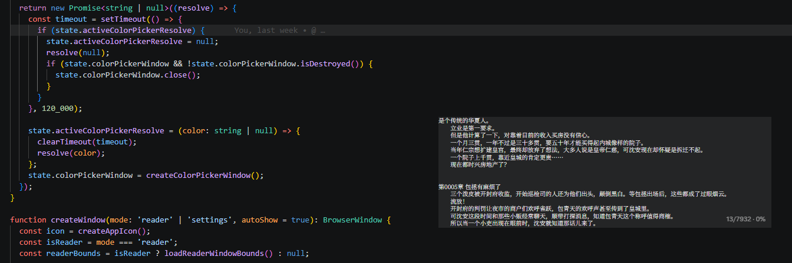
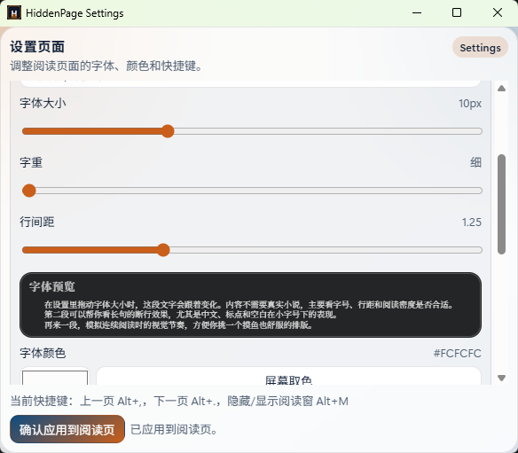

<p align="center">
  
</p>

<h1 align="center">HiddenPage (隐页)</h1>

<p align="center">
  
  
  
  
</p>

<p align="center"><em>A lightweight, tray-dwelling local TXT novel reader for Windows. <br>Read discreetly — one keystroke hides everything.</em></p>

## Screenshots

<p align="center">
  
  &nbsp;&nbsp;
  
</p>
<p align="center"><em>Left: Reading window &nbsp;|&nbsp; Right: Settings panel</em></p>

---

## Features

- **Tray resident** — the reading window hides from the taskbar; always one hotkey away
- **Distraction-free** — borderless, minimal interface with nothing but text
- **Large file support** — segmented rendering engine handles 20MB+ files without lag
- **Encoding auto-detection** — UTF-8, GBK/GB2312, Big5, Shift-JIS, EUC-KR, and more
- **Global hotkeys** — page turns and window toggle work even when the app isn't focused
- **Fully customizable** — font family, size, weight, line height, text color, background color
- **Screen color picker** — sample any pixel on your desktop for the perfect reading background
- **Full-text search** — find any phrase instantly with match navigation
- **Jump to page** — go to any page by number
- **Drag & drop** — drop a TXT file onto the window to start reading
- **Auto-save progress** — character-offset based, survives font and window size changes
- **Recent files** — quick access to your last opened novel

## Installation

### Option A: Portable (no install)

Download `HiddenPage-<version>-portable.exe` from the [Releases](https://github.com/Webberlin422/Hidden-Page/releases) page and run it directly. Nothing is installed — your reading data stays in the same folder.

### Option B: Installer

Download `HiddenPage Setup <version>.exe` from [Releases](https://github.com/Webberlin422/Hidden-Page/releases), run the installer, and choose an installation directory. The installer adds desktop and start menu shortcuts, plus a `.txt` file association.

---

# 隐页 HiddenPage

HiddenPage 是一个运行在 Windows 上的轻量本地小说阅读器，基于 Electron + TypeScript + Vite 构建。它常驻系统托盘，主打快捷隐藏、快速恢复和简洁阅读界面，适合在工作或学习场景中安静阅读 TXT 小说。

## 截图

<p align="center">
  
  &nbsp;&nbsp;
  
</p>
<p align="center"><em>左：阅读窗口 &nbsp;|&nbsp; 右：设置面板</em></p>

## 功能特点

- 托盘常驻，窗口不显示在 Windows 任务栏
- 阅读页极简，只保留小说内容显示区域
- 大文件分段渲染，20MB+ 的 TXT 也能流畅翻页
- 自动检测文件编码，支持 UTF-8、GBK/GB2312、Big5、Shift-JIS、EUC-KR 等
- 全局快捷键翻页和隐藏/显示窗口（应用未聚焦时仍可用）
- 支持从托盘菜单打开本地 TXT 小说
- 支持拖拽 TXT 文件到阅读页打开
- 阅读进度自动保存（基于字符偏移，更换字体/窗口大小后不丢失）
- 全文搜索，支持匹配高亮和快速导航
- 跳转到指定页码
- 最近打开记录

## 阅读外观设置

- **字体样式**：衬线 (宋体) / 无衬线 (黑体) / 系统默认
- **字号**：1 – 30px
- **字重**：300 – 700
- **行高**：0.5 – 3.0
- **文字颜色 / 背景颜色**：内置颜色选择器 + 屏幕取色器

## 默认快捷键

| 快捷键   | 操作                   |
| -------- | ---------------------- |
| `Alt+M`  | 隐藏 / 显示阅读窗口    |
| `Alt+,`  | 上一页                 |
| `Alt+.`  | 下一页                 |
| `Ctrl+F` | 搜索（阅读窗口内）     |
| `Ctrl+G` | 跳转到指定页           |
| `Esc`    | 关闭搜索栏 / 跳转对话框 |

快捷键可在设置页中完全自定义。

## 运行环境

- Windows 10 / 11（64 位）
- 无需安装 Node.js（打包版为独立可执行文件）

## 技术栈

| 层面     | 技术                              |
| -------- | --------------------------------- |
| 运行时   | Electron 42                       |
| 构建     | Vite + vite-plugin-electron       |
| 语言     | TypeScript                        |
| 编码检测 | jschardet                         |
| 编码转换 | iconv-lite                        |
| 测试     | Vitest (单元) + Playwright (E2E)  |
| 打包     | electron-builder (portable + NSIS) |

## 本地开发

### 环境要求

- Node.js 18+
- npm

### 安装运行

```bash
# 安装依赖
npm install

# 开发模式（Vite 热更新 + Electron 自动重启）
npm run dev

# 生产构建
npm run build

# 构建 Windows 安装包
npm run dist:win
```

### 运行测试

```bash
# 单元测试
npm test

# 端到端测试
npm run test:e2e
```

## 项目结构

```
Hidden-Page/
├── electron/              # Electron 主进程
│   ├── main.ts            # 应用入口、窗口管理、IPC、托盘
│   ├── preload.ts         # contextBridge API 暴露
│   ├── shortcuts.ts       # 全局快捷键注册
│   ├── encoding.ts        # 编码自动检测与转换
│   ├── document-manager.ts # 文档缓存 (LRU) + 分段读取
│   ├── state.ts           # 主进程共享状态
│   └── types.ts           # 类型重导出
├── src/                   # 渲染进程
│   ├── app.ts             # 入口、模式调度 (reader/settings/picker)
│   ├── reader-engine.ts   # 分页引擎、文本渲染、搜索高亮
│   ├── picker.ts          # 屏幕取色器
│   ├── styles/app.css     # 全局样式
│   ├── types/             # TypeScript 类型声明
│   └── utils/             # 工具函数 (快捷键、存储)
├── assets/                # 应用图标
├── index.html             # 阅读模式入口
├── settings.html          # 设置模式入口
├── picker.html            # 取色器模式入口
├── package.json
├── tsconfig.json
├── vite.config.ts
├── LICENSE
└── readme.md
```

## 贡献

欢迎提交 Issue 和 Pull Request。

- Bug 报告 / 功能建议 → [GitHub Issues](https://github.com/Webberlin422/Hidden-Page/issues)
- 代码风格：ESLint + Prettier（提交前请运行 `npm run format`）

## 许可

本项目采用 [CC BY-NC 4.0](LICENSE) 许可协议。

- ✅ 个人免费使用
- ✅ 自由分享、修改
- ❌ **禁止商业用途** — 如需商用（包括但不限于：销售、捆绑于付费产品、在企业环境中部署等），请联系作者获取付费授权

---

© 2026 [Webber Lin](https://github.com/Webberlin422). All rights reserved.
